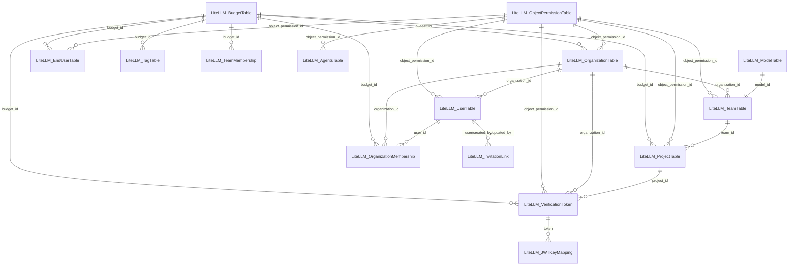

# LiteLLM Database Handbook — `v1.83.14-stable.patch.3`

> **What this is.** The single, authoritative reference for the LiteLLM proxy Postgres schema, written so
> an agent **with no web access** can understand and safely operate the DB. Every structural claim is rooted
> in the **live database**; every table's purpose is rooted in **LiteLLM's own Prisma schema comments**;
> every cost-behaviour claim is rooted in **official LiteLLM docs** (cited inline).
>
> ⚠️ **Scope: this is the HOMELAB snapshot.** Work was assumed identical, but work-claude counts **65 base
> tables vs homelab's 62** (+3). **Cause:** work's floating tag drifted to a *higher* LiteLLM version (adding
> tables via forward migrations), then was pinned **back down** to 1.83.14. Prisma migrations are **forward-only**,
> so the downgrade couldn't remove them → they're **stranded orphans** (1.83.14 doesn't use them). Homelab was a
> clean `1.81→1.83.14` forward pin, so it never had them. Confirm via work's `_prisma_migrations`: entries newer
> than the head `20260418000000_add_adaptive_router_tables` = the drift artifacts. **Treat this map as
> homelab/1.83.14-faithful;** the 3 work-extras are out-of-scope orphans.

## Verification basis (how to trust this doc)

| Layer | Source of truth | Status |
|---|---|---|
| Tables / columns / types / PK / FK / indexes | **Live DB introspection** (`introspect.sql` → `_introspect-homelab-raw.txt`) | ✅ ground truth, captured 2026-05-31 |
| Per-table purpose / field intent | **Upstream Prisma schema** `_schema.prisma.v1.83.14-stable.patch.3` (LiteLLM source; carries `//` comments) | ✅ verified table-by-table |
| Cost calculation / cost-map behaviour | **Official docs** — `docs.litellm.ai/docs/proxy/cost_tracking`, `/docs/proxy/custom_pricing`, `/blog/model-cost-map-incident` | ✅ fetched & cited |
| `$0`-spend bug specifics | `../docs/cost-tracking-incident-investigation-brief.md` + GitHub issue #27612 | ✅ cross-referenced |

If you (an agent) need a fact not here, prefer in this order: `_introspect-homelab-raw.txt` (structure) →
`_schema.prisma.*` (intent) → ask a human. Do **not** invent column names — grep the raw file.

## Provenance

| | |
|---|---|
| Image | `ghcr.io/berriai/litellm-database:v1.83.14-stable.patch.3` |
| Digest | `sha256:ec721a5e4b0decb3658c74b696e315dc3e1c664adbfbadded0564ee2d6cc03bc` |
| Postgres | 16.11 · DB name `litellm` |
| Schema head | migration `20260418000000_add_adaptive_router_tables` (119 applied) |
| Tables | **62** (61 Prisma models + `_prisma_migrations`) |
| Views | **8** — LiteLLM admin-UI spend analytics + `LiteLLM_VerificationTokenView` (`relkind='v'`, not Prisma). **62 tables + 8 views = 70 relations.** |
| `STORE_MODEL_IN_DB` | `True` — models **and their pricing** live in the DB, not just `config.yaml` |
| Snapshot | homelab DB (external Postgres on docker-01), 2026-05-31; version-identical to work RDS |

Regenerate structure: `psql -U litellm -d litellm -F'|' -tA -f introspect.sql`.
Prove work==homelab: run `verify-parity.sql` on each, `diff` (no output = identical schema).

> Row counts below are the homelab snapshot (small) — read them as "is this table used here," not work volume.
> `est_rows=-1` = never `ANALYZE`d (empty/near-empty), not missing.

---

## 30-second mental model

LiteLLM is an LLM gateway/proxy. The DB models six concerns:

1. **Auth** — *virtual API keys* (`LiteLLM_VerificationToken`, PK = the **hashed** key) are the central object.
2. **Org hierarchy** — `Organization → Team → Project → key`; `User` (internal admins/proxy users) attach via
   membership tables. **End-users** (`LiteLLM_EndUserTable`) are downstream callers (the `user` request field).
3. **Budgets/limits** — one hub (`LiteLLM_BudgetTable`) is referenced by keys, teams, orgs, end-users,
   projects, tags, and memberships (`max_budget`, tpm/rpm, reset cadence).
4. **Spend** — every request appends one `LiteLLM_SpendLogs` row; six `LiteLLM_Daily*Spend` tables hold
   per-entity/day rollups. **These tables carry no foreign keys** — they reference `team_id`/`user_id`/`tag`
   as plain strings and are fully rebuildable from `SpendLogs`.
5. **Models/pricing** — DB/UI-managed models live in `LiteLLM_ProxyModelTable`; **per-token pricing is stored
   in its `model_info` JSON at add-time** (the seat of the `$0`-spend bug — see §Cost path).
6. **Governance & features** — permissions, MCP, guardrails/policies, tools, vector stores, managed files,
   prompts, skills, agents, adaptive router, audit, health checks, config.

Two **hub tables** dominate the FK graph: `LiteLLM_BudgetTable` and `LiteLLM_ObjectPermissionTable`.

---

## Relationship graph

26 foreign keys total; the spend/log tables are deliberately FK-free.

| Child.column | → Parent.column | On delete |
|---|---|---|
| `VerificationToken`.{budget_id, organization_id, project_id, object_permission_id} | Budget / Organization / Project / ObjectPermission | SET NULL |
| `JWTKeyMapping`.token | `VerificationToken`.token | RESTRICT |
| `TeamTable`.{organization_id, model_id, object_permission_id} | Organization / Model / ObjectPermission | SET NULL |
| `ProjectTable`.{team_id, budget_id, object_permission_id} | Team / Budget / ObjectPermission | SET NULL |
| `UserTable`.{organization_id, object_permission_id} | Organization / ObjectPermission | SET NULL |
| `OrganizationTable`.budget_id / object_permission_id | Budget (RESTRICT) / ObjectPermission (SET NULL) | mixed |
| `OrganizationMembership`.{organization_id, user_id} / budget_id | Organization, User (RESTRICT) / Budget (SET NULL) | mixed |
| `TeamMembership`.budget_id · `EndUserTable`.{budget_id, object_permission_id} · `TagTable`.budget_id · `AgentsTable`.object_permission_id | Budget / ObjectPermission | SET NULL |
| `InvitationLink`.{user_id, created_by, updated_by} | `UserTable`.user_id | RESTRICT |

> Beware `model_id` overload: `TeamTable.model_id` is an **Int FK → `LiteLLM_ModelTable.id`** (team alias set).
> `SpendLogs.model_id` / `ErrorLogs.model_id` are **free-text** copies of the proxy model id (no FK). Different things.

---

## Cost / spend path — DEEP DIVE (the operational core)

### How a request becomes spend  *(src: docs/proxy/cost_tracking, custom_pricing)*

1. Response returns with token usage. LiteLLM computes
   `spend = prompt_tokens × input_cost_per_token + completion_tokens × output_cost_per_token`
   (plus `cache_creation_input_token_cost` / `cache_read_input_token_cost` for prompt-cache tokens).
   It also surfaces the figure in the `x-litellm-response-cost` response header.
2. **Per-token prices** come from the **model cost map** *(src: blog/model-cost-map-incident)* — a JSON file
   `model_prices_and_context_window.json` fetched from GitHub `main` at import (falls back to the bundled local
   copy; `LITELLM_LOCAL_MODEL_COST_MAP=True` pins to local and skips the fetch). For DB/UI-added models, the
   resolved price is captured into `LiteLLM_ProxyModelTable.model_info` **at add-time**. Explicit
   `model_info` prices in `model_list` **override** the cost map.
3. One row is appended to **`LiteLLM_SpendLogs`** (`spend double precision DEFAULT 0.0`).
4. Rollups aggregate into the six **`LiteLLM_Daily*Spend`** tables (derived; rebuildable from SpendLogs).

### The tables  *(structure: live introspection; intent: Prisma comments)*

| Table | Rows | Role | Notable columns |
|---|---|---|---|
| **`LiteLLM_SpendLogs`** | 55 | **Source of truth** — 1 row/request | `request_id`(PK), `spend`, `prompt_tokens`, `completion_tokens`, `total_tokens`, `model`, `model_id`, `model_group`, `custom_llm_provider`, `api_key`(hashed=`VerificationToken.token`), `team_id`, `end_user`, `organization_id`, `agent_id`, `session_id`, `status`, `startTime`/`endTime`, `metadata`(jsonb — **holds `project_id`**), `request_tags`(jsonb), `response`/`messages`/`proxy_server_request`(jsonb). Idx: `startTime`, `(startTime,request_id)`, `end_user`, `session_id`. **No FKs. No cache-token columns** (see backfill note). |
| `LiteLLM_DailyUserSpend` | 172 | per-user/day/model rollup | see shared shape ↓ |
| `LiteLLM_DailyTeamSpend` | 172 | per-team/day/model rollup | ″ |
| `LiteLLM_DailyTagSpend` | 28 | per-tag/day rollup | **different shape** — keyed by `tag`, also has `request_id` |
| `LiteLLM_DailyEndUserSpend` | 4 | per-end-user/day rollup | ″ shared shape |
| `LiteLLM_DailyOrganizationSpend` | 0 | per-org/day rollup | ″ |
| `LiteLLM_DailyAgentSpend` | 0 | per-agent/day rollup | ″ |
| `LiteLLM_SpendLogToolIndex` | 0 | fast "last-N logs for a tool" — `(request_id, tool_name)`; join to `LiteLLM_ToolTable` | |
| `LiteLLM_SpendLogGuardrailIndex` | 0 | fast "last-N logs for a guardrail/policy" — `(request_id, guardrail_id)`, optional `policy_id` | |
| `LiteLLM_ErrorLogs` | 0 | failed-request log (`exception_type`, `exception_string`, `status_code`) | |

**Shared `Daily*Spend` shape** (verified, Prisma): `id`(uuid PK), `<entity>_id`, `date`(string `YYYY-MM-DD`),
`api_key`, `model`, `model_group`, `custom_llm_provider`, `mcp_namespaced_tool_name`, `endpoint`,
`prompt_tokens`, `completion_tokens`, **`cache_read_input_tokens`**, **`cache_creation_input_tokens`**, `spend`,
`api_requests`, `successful_requests`, `failed_requests`. **Unique key** =
`(<entity>_id, date, api_key, model, custom_llm_provider, mcp_namespaced_tool_name, endpoint)` — that tuple is
the rollup grain; a faithful rebuild must `GROUP BY` exactly it.

### The `$0`-spend bug, in schema terms  *(src: investigation brief + issue #27612 + cost-map blog)*

- For UI/DB-added Bedrock **regional inference-profile** models (`au.`-prefixed), LiteLLM's prefix-strip means
  the key matches **no** cost-map entry at add-time → `LiteLLM_ProxyModelTable.model_info` stores
  `input_cost_per_token`/`output_cost_per_token` as **0/null**.
- Per the documented failure mode, *"a missing entry never blocks a call"* → `LiteLLM_SpendLogs.spend` is
  written as **`0.0`** (the column default) while **token counts stay correct**. Rollups then sum zeros.
- **Unfixed in every release** (#27612 open). Live hotfix = UI cost-map reload (in-memory → lost on restart).
  Durable fix = digest-pin + `LITELLM_LOCAL_MODEL_COST_MAP=True` + explicit `model_info` prices in `model_list`.
- **Backfill (because tokens survive):**
  `UPDATE "LiteLLM_SpendLogs" SET spend = prompt_tokens*<in_rate> + completion_tokens*<out_rate>
   WHERE spend = 0 AND model LIKE 'au.%' AND "startTime" BETWEEN …` — transaction-wrapped, `SELECT count(*)`
   first, sample-verify. Then **rebuild the affected `Daily*Spend` rows** (group by the unique tuple above).
  **Caveat:** `SpendLogs` has no `cache_*_tokens` columns, so cache-creation/read costs aren't recomputable
  from flat columns — for cache-accurate spend, parse `SpendLogs.response`/`metadata` JSON usage, or accept
  prompt+completion-only backfill if cache spend is negligible for the affected models.

---

## Table catalog (all 62 tables, by domain) — purposes rooted in Prisma comments

### Auth & keys
- **`LiteLLM_VerificationToken`** (5) — *"Generate Tokens for Proxy."* Virtual API keys; PK = hashed `token`.
  Carries `spend`, `max_budget`, `models[]`, tpm/rpm, `key_alias`, `blocked`, `permissions`, `budget_id`,
  `team_id`, `project_id`, `organization_id`, `object_permission_id`, plus **key-rotation** fields
  (`auto_rotate`, `rotation_interval`, `last_rotation_at`, `key_rotation_at`, `rotation_count`) — relevant to
  `admin-scripts/rotate-key.sh`. `SpendLogs.api_key` == this `token`.
- `LiteLLM_JWTKeyMapping` (0) — maps a JWT claim (`jwt_claim_name`/`value`) → a hashed `token` (FK). JWT auth.
- `LiteLLM_DeprecatedVerificationToken` — *"Deprecated keys during grace period"* — old key works until `revoke_at` (rotation).
- `LiteLLM_DeletedVerificationToken` — *"Audit table for deleted keys"* — preserves spend/metadata post-deletion.
- `LiteLLM_InvitationLink` — *"invite links sent by admin for people to join the proxy"* (FKs → UserTable ×3).
- `LiteLLM_SSOConfig` (0) — single-row (`id='sso_config'`) `sso_settings` JSON (the generic-OIDC/Keycloak UI SSO config).

### Org hierarchy
- **`LiteLLM_TeamTable`** (1) — *"Assign prod keys to groups, not individuals."* `team_id` PK; `spend`, budgets,
  `models[]`, `members_with_roles`, `policies[]`, `access_group_ids[]`; FK org/model/object_permission.
- `LiteLLM_DeletedTeamTable` — *"Audit table for deleted teams"* (soft-delete archive).
- **`LiteLLM_OrganizationTable`** (0) — top of hierarchy; `organization_alias`, `models[]`, `spend`; FK budget(RESTRICT)/object_permission.
- `LiteLLM_OrganizationMembership` — *"track Internal User and Organization membership … role within an Organization"* (PK `(user_id, organization_id)`).
- `LiteLLM_TeamMembership` — *"track the Internal User's Spend within a Team + Set Budgets, rpm limits for the user within the team"* (PK `(user_id, team_id)`).
- **`LiteLLM_UserTable`** (2) — *"Track spend, rate limit, budget Users."* Internal/proxy users; `user_id` PK, `user_role`, `sso_user_id`, `teams[]`, `spend`; FK org/object_permission.
- `LiteLLM_ProjectTable` — *"Projects sit between teams and keys for use-case management."* FK team/budget/object_permission; `project_id` is also stashed in `SpendLogs.metadata`.
- `LiteLLM_EndUserTable` — downstream end-users (`user_id` PK = the request `user`); `spend`, `blocked`, `allowed_model_region`, `default_model`; FK budget/object_permission.
- `LiteLLM_UserNotifications` — *"Beta - allow team members to request access to a model"* (`status`: approved/disapproved/pending).

### Budgets
- **`LiteLLM_BudgetTable`** (0) — *"Budget / Rate Limits for an org."* Hub (`budget_id` PK). `max_budget`,
  `soft_budget`, `max_parallel_requests`, `tpm_limit`/`rpm_limit`(BigInt), `model_max_budget`(Json),
  `budget_duration`/`budget_reset_at`, `allowed_models[]`. Referenced by 7 tables.

### Models & pricing
- **`LiteLLM_ProxyModelTable`** (0) — *"Models on proxy."* DB/UI-managed models (`STORE_MODEL_IN_DB`).
  `model_name`, `litellm_params`(provider/model/credential refs), **`model_info`(Json) — where per-token
  pricing is stored at add-time; the `$0`-bug seat.**
- `LiteLLM_ModelTable` (0) — *"Model info for teams, just has model aliases for now."* `id`(Int autoincr PK),
  `model_aliases`(Json, mapped from col `aliases`). FK target of `TeamTable.model_id` (1:1).
- `LiteLLM_CredentialsTable` (0) — reusable provider creds: `credential_name`(unique), `credential_values`(Json), `credential_info`(Json). Referenced by `litellm_params`.
- `LiteLLM_AccessGroupTable` — *"Unified Access Groups."* Bundles `access_model_names[]` **+** `access_mcp_server_ids[]` **+** `access_agent_ids[]`, assigned to `assigned_team_ids[]`/`assigned_key_ids[]`.

### Spend & audit
- See **§Cost path** for SpendLogs / the six `Daily*Spend` / `SpendLog*Index` / `ErrorLogs`.
- `LiteLLM_AuditLog` — admin-action trail: `action`(create/update/delete), `table_name`, `object_id`, `before_value`/`updated_values`(Json), `changed_by`/`changed_by_api_key`.

### Permissions (hub)
- **`LiteLLM_ObjectPermissionTable`** — object-level access bundle attached (via `object_permission_id` FK) to
  keys/teams/users/orgs/projects/end-users/agents. Arrays: `mcp_servers[]`, `mcp_access_groups[]`,
  `mcp_tool_permissions`(Json), `vector_stores[]`, `agents[]`, `models[]`, `blocked_tools[]`, `mcp_toolsets[]`.

### Config & coordination
- **`LiteLLM_Config`** — *"store proxy config.yaml"* — `param_name` PK / `param_value`(Json). The rows the proxy polls continuously (the steady idle `SELECT … FROM LiteLLM_Config`).
- `LiteLLM_ConfigOverrides` — one row per `config_type`. `LiteLLM_UISettings` — single-row UI prefs. `LiteLLM_CacheConfig` — single-row cache settings.
- `LiteLLM_CronJob` — *"Only allow one pod to run the job at a time"* — leader election (`pod_id`, `status` enum ACTIVE/INACTIVE, `ttl` lease). **Matters if `replicaCount>1`.**

### MCP (Model Context Protocol)
- `LiteLLM_MCPServerTable` — registered MCP servers (transport, auth_type, health status, BYOK/BYOM lifecycle, `available_on_public_internet`).
- `LiteLLM_MCPToolsetTable` — *"Named collection of {server_id, tool_name} pairs"* granted to keys/teams.
- `LiteLLM_MCPUserCredentials` — *"Per-user BYOK credentials for MCP servers"* (`credential_b64`, unique `(user_id, server_id)`).

### Guardrails, policies, tools
- `LiteLLM_GuardrailsTable` — guardrail configs (`litellm_params`, submission `status`).
- `LiteLLM_PolicyTable` — *"guardrail policies (versioned)"* — `(policy_name, version_number)` unique, `version_status` draft/published/production, `pipeline`(Json).
- `LiteLLM_PolicyAttachmentTable` — where a policy applies (`teams[]`/`keys[]`/`models[]`/`tags[]`, `scope`).
- `LiteLLM_ToolTable` — *"Global tool registry - auto-discovered from LLM responses; admins set input/output policies."* `tool_name`(unique), `input_policy`/`output_policy` (trusted/untrusted/blocked), `call_count`.
- `LiteLLM_DailyGuardrailMetrics` / `LiteLLM_DailyPolicyMetrics` — one row per guardrail/policy per day (`requests_evaluated`, `passed/blocked/flagged_count`, `avg_score`, `avg_latency_ms`); PK `(id, date)`.
- `LiteLLM_SearchToolsTable` — search-tool configs (`search_tool_name` unique, `litellm_params`).

### Files, vector stores, objects  *(note the confusingly-similar names — they are 3 distinct tables)*
- `LiteLLM_ManagedFileTable` — unified Files API metadata (`unified_file_id`, `model_mappings`, `storage_backend`/`storage_url`).
- `LiteLLM_ManagedObjectTable` — *"for batches or finetuning jobs"* — `file_purpose` 'batch'|'fine-tune', `batch_processed` (cost-tracked flag).
- `LiteLLM_ManagedVectorStoreTable` (singular) — unified/managed vector store (`unified_resource_id`, `model_mappings` model_id→provider store id).
- `LiteLLM_ManagedVectorStoresTable` (plural) — **different table**: per-provider store record (`vector_store_id` PK, `custom_llm_provider`, `team_id`/`user_id`).
- `LiteLLM_ManagedVectorStoreIndexTable` — vector-store **index** configs (`index_name` unique, `litellm_params`).

### Agentic / newer subsystems
- `LiteLLM_AgentsTable` — *"Agents on proxy"* — A2A agents (`agent_card_params`, `spend`, tpm/rpm, FK object_permission).
- `LiteLLM_PromptTable` — versioned prompt templates (unique `(prompt_id, version, environment)`).
- `LiteLLM_SkillsTable` — LiteLLM-managed skills (`instructions` from SKILL.md, `file_content` Bytes/zip, `source` custom|anthropic).
- `LiteLLM_MemoryTable` — *"User/team-scoped memory store with a GLOBAL unique `key`"*; `value` is text (LLM-context markdown). `user_id`/`team_id` stamp ownership but are **not** part of the unique key (namespace your keys).
- `LiteLLM_AdaptiveRouterState` — *"Per-(router, request_type, model) Beta posterior"* for the adaptive (bandit) router (`alpha`, `beta`, `total_samples`; PK `(router_name, request_type, model_name)`).
- `LiteLLM_AdaptiveRouterSession` — per-(session, router, model) signal counters (misalignment/stagnation/satisfaction/etc.) driving routing decisions.
- `LiteLLM_ClaudeCodePluginTable` — Claude Code plugin marketplace (`name` unique, `manifest_json`, `files_json`, `enabled`).
- `LiteLLM_TagTable` — *"Track tags with budgets and spend"* (`tag_name` PK, `spend`, FK budget).
- `LiteLLM_HealthCheckTable` — per-model health-check results (`status`, healthy/unhealthy counts, `response_time_ms`).

### Bookkeeping
- `_prisma_migrations` — Prisma migration ledger (only non-model table; 119 applied). **Forward-only — no down migrations exist upstream.**

---

## Views (8) — LiteLLM admin-UI spend analytics  *(`relkind='v'`, NOT Prisma models)*

Ship with LiteLLM (present on homelab **and** work); power the admin UI's spend panels. All **read-only,
derived from `LiteLLM_SpendLogs`** (so they inherit the `$0`-spend bug when pricing breaks) — except the token
view. Our original introspect missed them (it filtered `relkind='r'`, tables only).

| View | Built on | Returns |
|---|---|---|
| `MonthlyGlobalSpend` | SpendLogs | spend per day, last 30d (name says "monthly" but it's last-30d daily) |
| `MonthlyGlobalSpendPerKey` | SpendLogs | ″ by `api_key` |
| `MonthlyGlobalSpendPerUserPerKey` | SpendLogs | ″ by `api_key` + `user` |
| `DailyTagSpend` | SpendLogs | per-tag/day spend (unnests `request_tags`) — the **view**, distinct from the `LiteLLM_DailyTagSpend` **table** |
| `Last30dKeysBySpend` | SpendLogs ⋈ VerificationToken | top keys by spend, 30d (+ `key_alias`) |
| `Last30dModelsBySpend` | SpendLogs | top models by spend, 30d |
| `Last30dTopEndUsersSpend` | SpendLogs | top end-users by spend, 30d |
| `LiteLLM_VerificationTokenView` | VerificationToken | flattened key list for the UI |

> All key off `SpendLogs."startTime"` over `CURRENT_DATE - 30 days`, in **UTC**.

## Operational gotchas (verified)

- **Forward-only migrations.** No `down.sql` upstream → a version downgrade has no clean schema reverse
  (restore-from-backup only). Never downgrade the image expecting the schema to follow. *(brief §Downgrade)*
- **`STORE_MODEL_IN_DB=True`** → models + pricing are in `LiteLLM_ProxyModelTable`, not `config.yaml`.
- **Pricing is captured at model add-time** into `model_info`, not looked up live per request → a wrong/missing
  price persists until the model is re-saved or the in-memory cost map is reloaded. *(custom_pricing + brief)*
- **Cost map silently degrades to `$0`** for unmapped models — never errors. Pin it with
  `LITELLM_LOCAL_MODEL_COST_MAP=True`. *(blog/model-cost-map-incident)*
- **Hashed keys.** `SpendLogs.api_key` and `VerificationToken.token` are hashes, not the `sk-…` value.
- **Spend tables are derived & FK-free** → safe to rebuild `Daily*Spend` from `SpendLogs`; they key on strings.
- **Single-writer jobs** gated by `LiteLLM_CronJob` lease — relevant before scaling `replicaCount>1`.
- **Read-only introspection is always safe**; any write (e.g. backfill) → transaction + count-first + sample-verify.

## Files here
- `SCHEMA-MAP.md` (this) · `introspect.sql` (regenerator) · `verify-parity.sql` (work↔homelab diff)
- `_introspect-homelab-raw.txt` (full live dump) · `_schema.prisma.v1.83.14-stable.patch.3` (upstream source)
